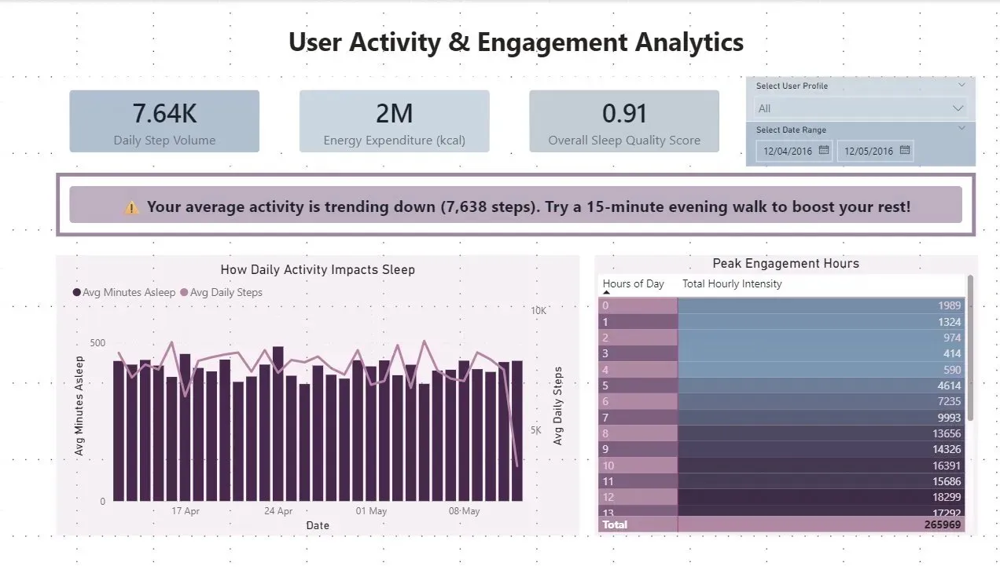

# 🏋️ Fitness Tracker Dashboard

A Power BI dashboard exploring the relationship between daily physical activity and sleep quality, built using real Fitbit data.

---

## ⚡ TLDR

Analysed 30 days of Fitbit data across 33 users to understand how movement patterns affect sleep. Built a multi-page Power BI dashboard with dynamic KPI cards, custom DAX measures, and an actionable smart alert system. Key finding: users who hit peak activity between 8am and 12pm consistently showed better sleep quality scores than those with irregular intensity patterns.

---

## 📊 Dashboard Preview

> KPI cards showing daily step volume, energy expenditure, and sleep quality score. The dual-axis chart overlays average minutes asleep against average daily steps over time, with a peak engagement hours breakdown by hour of day.

---

## 🎯 Project Overview

This project analyses how daily movement, intensity levels, and step counts correlate with sleep duration and quality. The goal is to surface actionable patterns that help users understand the impact of their activity habits on rest and recovery.

---

## 📁 Dataset

| File | Description |
|---|---|
| `Activity_Clean.csv` | Daily activity summaries |
| `Analyzed_Daily_Activity.csv` | Enriched activity metrics |
| `Intensity_Clean.csv` | Activity intensity breakdowns |
| `Sleep Clean.csv` | Sleep duration and quality records |
| `dailyActivity_merged.csv` | Merged daily activity across users |
| `hourlyIntensities_merged.csv` | Hourly intensity data |
| `sleepDay_merged.csv` | Daily sleep summaries |

> **Note:** The raw minute-level step file (~34 MB) is not stored in this repo to keep it lightweight. All raw data comes from the public [FitBit Fitness Tracker Data](https://www.kaggle.com/datasets/arashnic/fitbit) dataset on Kaggle.

---

## 🔧 Technical Details

**DAX Measures built:**
- Average sleep duration per user
- Daily active minutes segmentation (sedentary, lightly active, fairly active, very active)
- Step target achievement rate
- Hourly intensity scoring
- Smart alert logic for below-average activity trends

**Data modelling:**
- Star schema with activity, intensity, and sleep tables
- Relationships built across merged CSV sources
- Power Query used for cleaning, type casting, and null handling

---

## 💡 Key Findings

- Users with consistently high active minutes between 8am and 12pm showed better average sleep quality scores
- Irregular intensity patterns across the day correlated with shorter and more fragmented sleep
- Average daily step volume of 7,638 fell below the 10,000 step benchmark for the cohort
- Peak engagement hours were concentrated between 8am and 1pm, with a sharp drop in the afternoon

---

## 🛠 Tools Used

Power BI, DAX, Power Query, Excel CSV

---

## 📬 Connect

